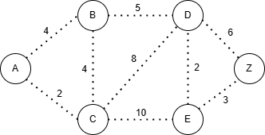
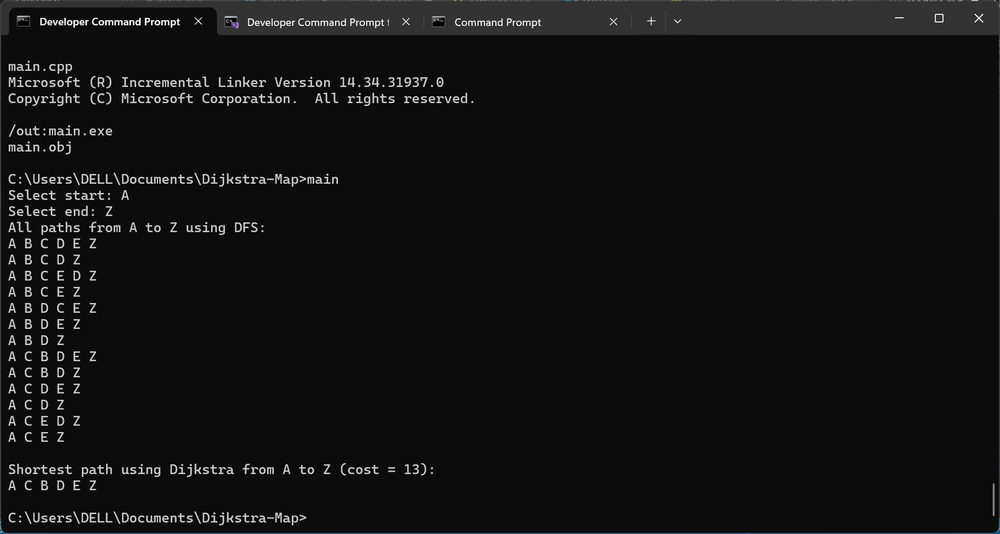

# 🔍 Dijkstra Pathfinding Project in C++

## 📚 Overview

This is a small academic project for the **Data Structures and Algorithms (DSA)** course at **Hanoi University of Science and Technology (HUST)**. The program is implemented in **C++** and allows you to:

- Load a weighted undirected graph from a CSV file
- Find **all possible paths** between two nodes using **Depth First Search (DFS)**
- Find the **shortest path** and its **total cost** using **Dijkstra’s algorithm**

## 📂 Input

- The input file is named `graph.csv`
- Each line represents an edge in the graph, in the format:
    ```bash
    From,To,Weight
    A,B,4
    ```

## ⚙️ Features

1. **Graph Loader**: Reads edge data from `graph.csv` and stores it in an adjacency list
2. **DFS Path Finder**: Finds all possible paths between two nodes
3. **Dijkstra's Algorithm**: Computes the shortest path and prints its total cost

## 🚀 How to Run

### Compile (using MSVC or g++)
    ```bash
    cl /EHsc /std:c++20 main.cpp && main.exe
    ```

## 🧪 Output

- The program first prints all paths from the start node to the end node using DFS
- Then it prints the shortest path and its cost using Dijkstra

## 🛠 Dependencies

- Standard C++ libraries only (```<iostream>, <fstream>, <sstream>, <vector>, <unordered_map>, <queue>, <set>, <limits>```)

## 👨‍💻 Author

- Phạm Chí Vỹ
- HUST - Data Structures & Algorithms Course

## 📌 Result




